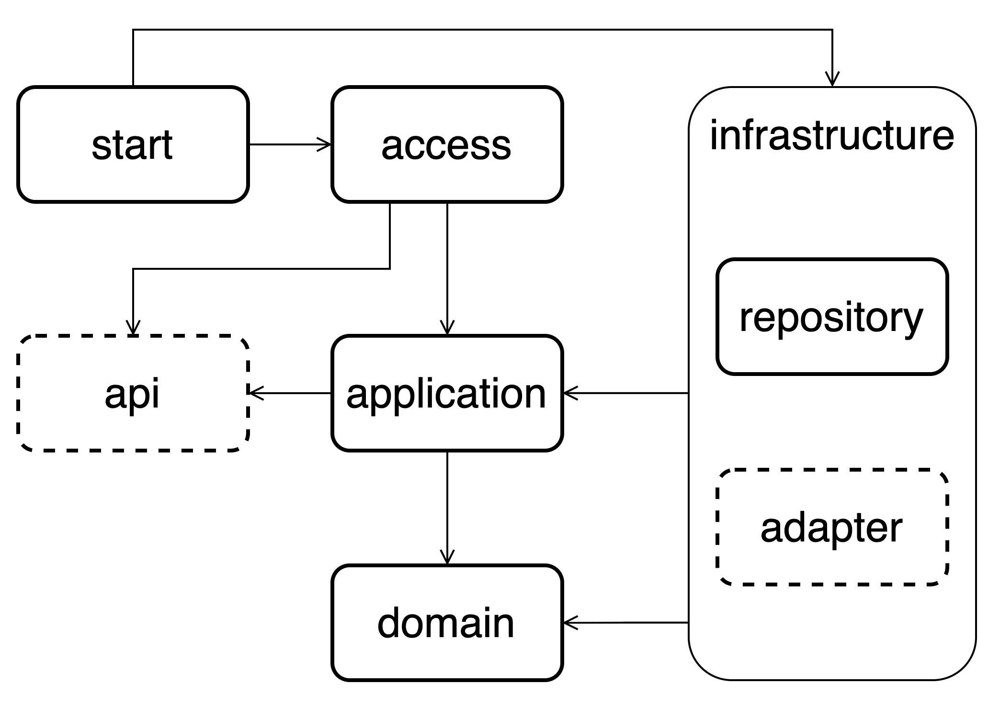
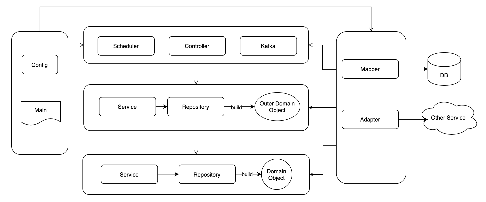
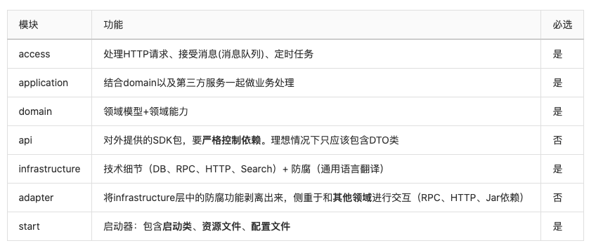

# 各种小工具等

## 模块化
+ DDD
+ COLA分层

## 技术栈&中间件选择
### MySQL
#### 连接池
+ HikariCP 性能好，社区支持好。推荐
* druid：性能较好，但是不支持jdk11，社区支持差。
#### 框架
+ MyBatis/Mybatis Plus

### Redis
#### 连接池
+ Lettuce 推荐
+ Redission 可以用，但不要大范围用。容易有坑
+ Jedis 性能差，禁止用
#### 其他规范
+ key必须有过期时间，否则小概率丢失key

### Json
+ Jackson 推荐
+ FastJson 禁止用，坑贼多。虚假的性能好

### 线程池
+ 建议自己实现，或有项目封好的包。
+ @Async注解 不推荐

### ES
+ High Level Rest Client
+ 旧版本的客户端连接上有问题

### 缓存
+ Redis 默认情况全都用redis。不加本地缓存
+ Hazelcast 分布式本地缓存，超大并发时可以用

## 调试工具
### 线上debug  
+ [arthas](https://arthas.aliyun.com/doc/) 阿里开源的Java诊断工具

todo arthas常用命令文档

## 优化
+ 接入的apm